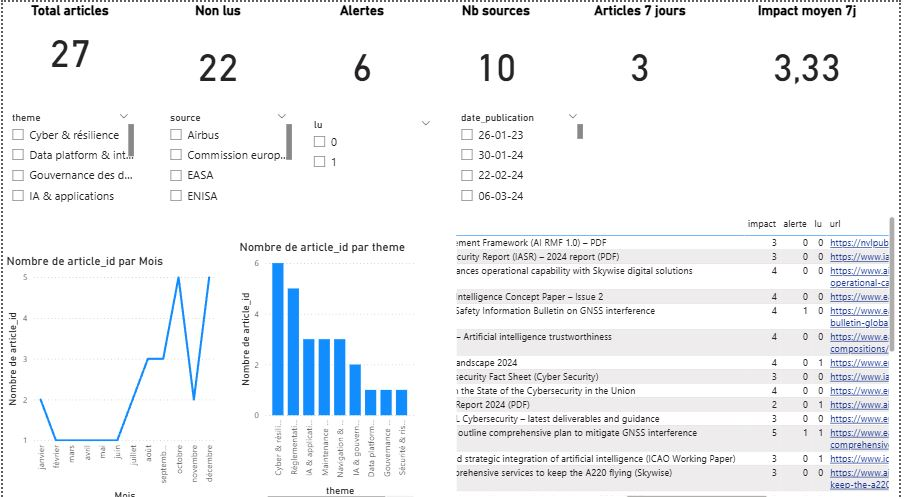
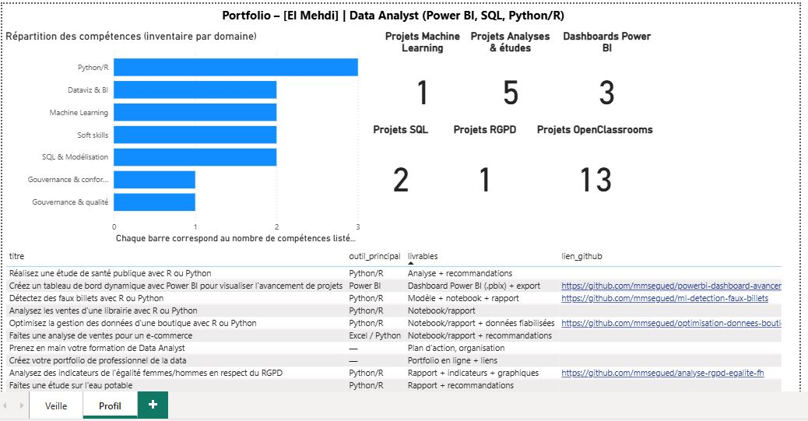

# portfolio-data-analyst
Portfolio Data Analyst (Power BI, SQL, Python/R) – Projets OpenClassrooms
# Portfolio – El Mehdi | Data Analyst (Power BI, SQL, Python/R)

##  Objectif
Présenter mes projets et livrables réalisés (parcours OpenClassrooms) et démontrer mes compétences de Data Analyst : analyse, qualité des données, SQL, dataviz, et communication.

##  Compétences
- **BI & Dataviz** : Power BI (modélisation, KPI, filtres, storytelling)
- **SQL** : requêtes, jointures, agrégations, modèle relationnel
- **Python/R** : EDA, nettoyage, préparation, analyses, ML de base
- **Méthodologie** : cadrage, documentation, restitution
- **Soft skills** : rigueur, esprit de synthèse, autonomie, communication

##  Projets phares
- **Power BI – Tableau de bord d’avancement de projets**
- **RGPD – Analyse des indicateurs d’égalité femmes/hommes**
- **Python/R – Optimisation de la gestion des données d’une boutique**
- **Machine Learning – Détection de faux billets**

##  Autres projets (OpenClassrooms)
- Analyse de ventes e-commerce
- Étude de santé publique
- Étude sur l’eau potable
- Analyse des ventes d’une librairie
- Étude de marché
- SQL : requêtes + base immobilière

   ## Livrables (Aéroworld)

-  Carte mentale (graphique) : [PDF](docs/Carte%20Mentale%20Portfolio%20Aeroworld.pdf)
-  Mockups (Veille + Profil + structure portfolio) : [PDF](docs/mockups_dashboards_portfolio.pdf)
-  Dashboard Veille (capture) : [PNG](docs/dashboard_veille.png)
-  Dashboard Profil (capture) : [PNG](docs/dashboard_profil.png)

### Aperçu

## 📫 Contact
- Email : (mseguedelmehdi@gmail.com)
